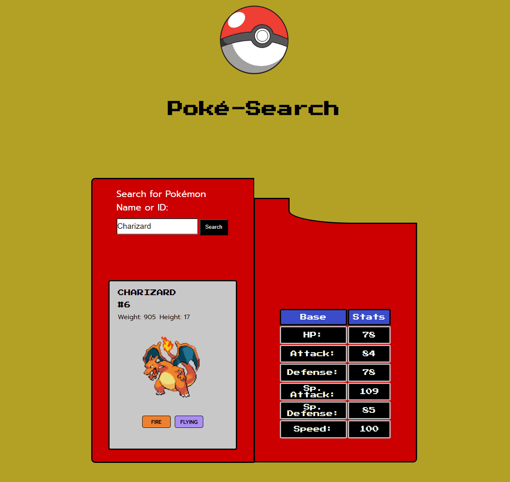

# About

Serving as the FreeCodeCamp capstone for the JavaScript DSA module, this web application allows for the user to enter a Pokémon's name or ID and get information for it back.
This was done by use of fetch requests to the [FreeCodeCamp PokeAPI Proxy](https://pokeapi-proxy.freecodecamp.rocks/api/pokemon).
The information gathered from the JSON includes the Pokémon's:
  - Name
  * ID in the National Pokédex
  + Weight and Height
  - Normal (non-shiny) Sprite
  * Typing
  + Base Stats

I aimed to make the GUI look similar to a Pokédex to give a more immersive feel to the web app.

# Getting Started

1. Download the files and store in a directory on your computer.
2. Copy the path to the index.html file in the directory.
3. Open your browser of choice.
4. Paste the path into your address bar.
5. Enter a Pokémon's name/ID and click the search button
6. Hunt down your favorite Pokémon! (Pokéballs not included)

# To-Do

- [ ] Add a button to change the sprite from normal to shiny variant or back to normal
- [ ] Add a rotate button to allow for viewing the sprite from the front or the back

